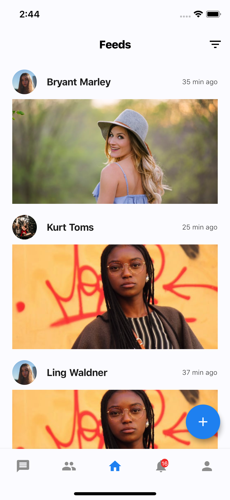
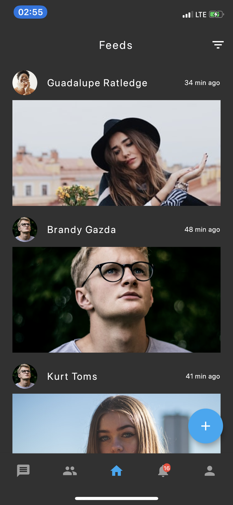
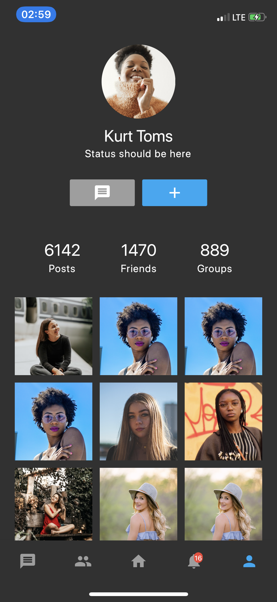

# Flutter Social App Concept 
Flutter representation of a Social App Concept i found on Uplabs.

Star the repo if you like what you see.

Images are from [Unsplash](https://unsplash.com)

<a href="ss/app.apk"></img></a>

[Link to Mockup](https://www.ls.graphics/free/simple-iphone-x-mockups)

## Requirements
* Any Operating System (ie. MacOS X, Linux, Windows)
* Any IDE with Flutter SDK installed (ie. IntelliJ, Android Studio, VSCode etc)
* A little knowledge of Dart and Flutter
* A brain to think

## 📸 ScreenShots

| Light| Dark|
|------|-------|
|||
|||
|||
|||

##Dark theme
Adapts to device theme

## Brain
**ADESOJI SUSAN ** 
